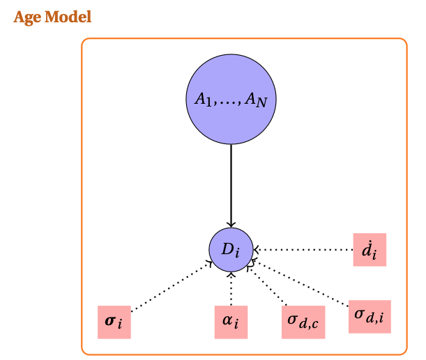
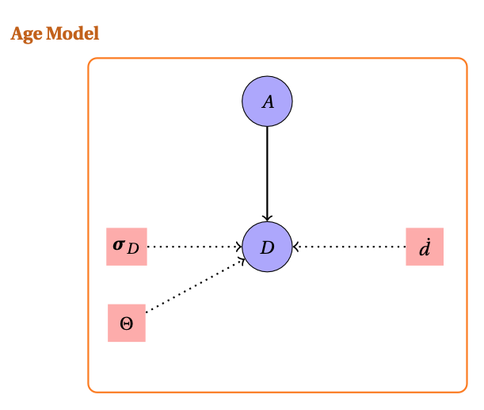
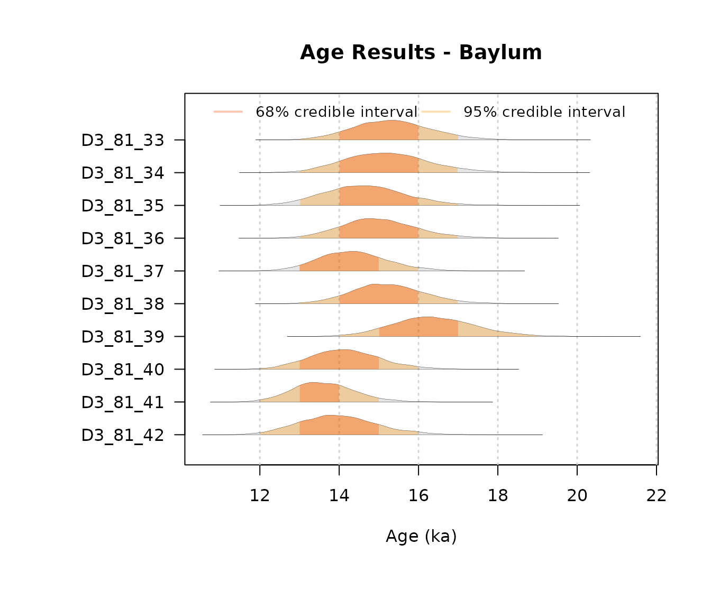
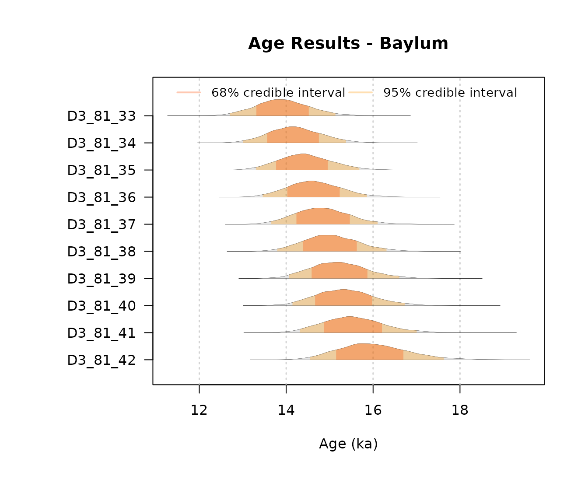
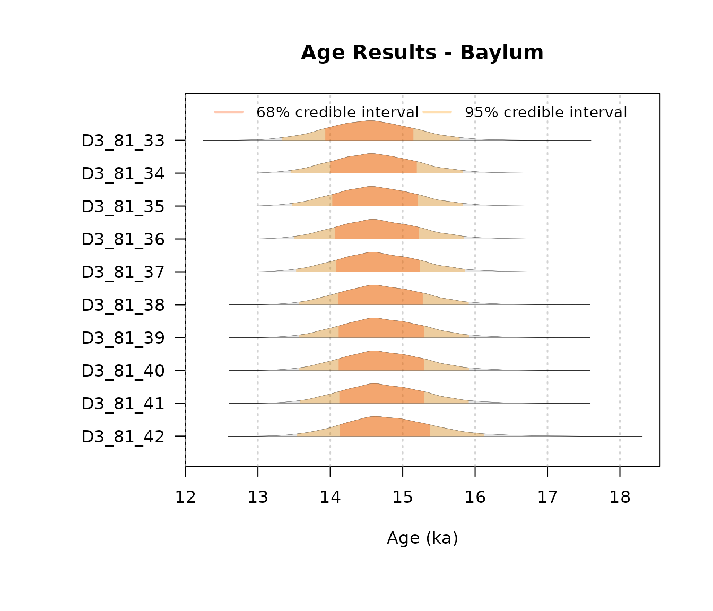
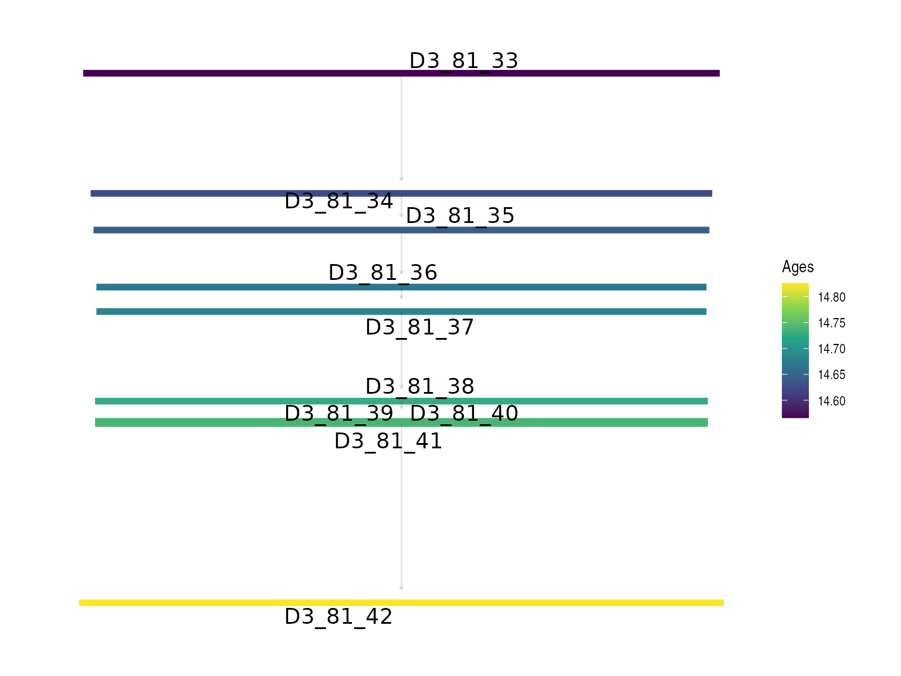
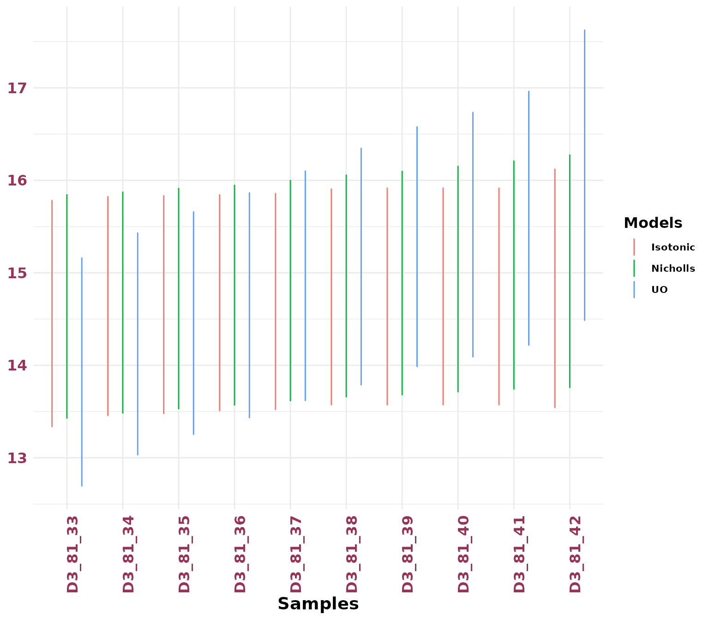

# Age Frameworks

This Vignette introduces the tools in **BayLumPlus** that extend the
original framework for age modelling.

``` r
library(BayLumPlus)
#> Loading required package: coda
```

### Age Models Function

In this section we present the splitting of the OSL Model presented in
Combès and Philippe (2017). We summarize our approach in the following
hierarchical model:



The model incorporates three primary data vectors:

- $\mathbf{A} = \left( A_{1},\ldots,A_{n} \right)$: the unknown ages to
  be estimated.
- $\mathbf{D} = \left( D_{1},\ldots,D_{n} \right)$: the equivalent doses
  obtained from luminescence measurements.
- ${\mathbf{σ}} = \left( \sigma_{1},\ldots,\sigma_{n} \right)$: the
  measurement uncertainties for equivalent doses.

The environmental context is characterized by known parameters:

- $\mathbf{d} = \left( d_{1},\ldots,d_{n} \right)$: mean annual dose
  rates for each sample.
- ${\mathbf{σ}}_{d} = \left( \sigma_{d_{1}},\ldots,\sigma_{d_{n}} \right)$:
  individual dose rate uncertainties.
- ${\mathbf{α}} = \left( \alpha_{1},\ldots,\alpha_{n} \right)$:
  contamination factors relating to systematic uncertainty.

However, this approach does not allow us to account for the complex
modeling of common errors. Therefore, instead of considering one common
error and a contamination factor, we set the $\Theta$ matrix which
represents the covariance matrix that summarizes the several common
errors we can consider (see documentation of
[`create_ThetaMatrix()`](https://imn167.github.io/BayLumPlus/reference/create_ThetaMatrix.md)).

The considered model can be summarized by the likelihood:

$$D \sim \mathcal{N}\left( \text{diag}(A)\mathbf{d};\ \text{diag}(A)\Theta\text{diag}(A) + \text{diag}({\mathbf{σ}}) \right)$$



The function allowing to compute such configuration is
[`Compute_AgeS_D()`](https://imn167.github.io/BayLumPlus/reference/Compute_AgeS_D.md).

In the following sections, we demonstrate how to use this function with
practical examples.

#### Measurements quantities

The function needs parameters (see `?Compute_AgeS_D()` ) such as a list
of `DATA` composed of  
- Equivalent Doses: $D$  
- Dose rate: $d$  
- Standard Error for $D$: $\mathbf{σ}$

An example of what it might look like

``` r
DATA = list( D = Doses, 
             ddot = dose_rate, 
             sD = standard_error_D)
```

#### Stratigraphics prior knowledge

The function can also require a matrix that summarizes the stratigraphic
constraints called `StratiConstraints`. Multiple choice are accepted :  
- A numeric matrix such as in
[`create_ThetaMatrix()`](https://imn167.github.io/BayLumPlus/reference/create_ThetaMatrix.md)
(meaning with a row of ones)  
- A path to a csv file

Note that several prior distributions can be tested:

- **Without stratigraphic constraints:**
  - *unconstrained_Jeffrey*
- **Under strict order:** $\{ A_{1} \leq \cdots, \leq A_{n}\}$
  - *StrictNicholls&Jones* : Nicholls & Jones applied directly to ages
    (see section 4 in Nicholls and Jones (2001) )
  - *constrained_Jeffrey* : Approached Jeffreys form

For more information use
[`help(ModelAgePrior)`](https://imn167.github.io/BayLumPlus/reference/ModelAgePrior.md).

For these priors there is no need to specify the parameter
`StratiConstraints` as it is supposed to be the **strict order** or no
constraints at all.

You can use the
[`extract_Jags_model()`](https://imn167.github.io/BayLumPlus/reference/extract_Jags_model.md)
function to check all available models and data structures in
**BayLumPlus**.

To illustrate usage, the following code snippet uses the OSL dataset
from Jingbian, China  
(see the package documentation for more details).

``` r
data("OSLJingbian") 
help(OSLJingbian)
```

We can use the **unconstrained_Jeffrey** prior for our first bayesian
computation. The following code snippet produces this scenario:

``` r
Output = Compute_AgeS_D(
  
  DATA = list(D = OSLJingbian$D, sD = OSLJingbian$sD, ddot = OSLJingbian$ddot),
  Nb_sample = OSLJingbian$Nb_Sample, SampleNames = OSLJingbian$SampleNames,
  ThetaMatrix = OSLJingbian$ThetaMatrix, prior = "unconstrained_Jeffrey", 
  jags_method = "rjags",
  PriorAge = rep(c(1, 1400), OSLJingbian$Nb_Sample),
  Iter = 2000, burnin = 50000, t = 10
) 
```

Note that the data `OSLJingbian` already have the object *Output*, which
is the return object of the code above.

Then the following code snippet shows when we use the
*constrained_Jeffrey* prior for the second bayesian model

``` r
JingbianUO = Compute_AgeS_D(
  
  DATA = list(D = OSLJingbian$D, sD = OSLJingbian$sD, ddot = OSLJingbian$ddot),
  Nb_sample = OSLJingbian$Nb_Sample, SampleNames = OSLJingbian$SampleNames,
  ThetaMatrix = OSLJingbian$ThetaMatrix, prior = "constrained_Jeffrey", 
  jags_method = "rjags",
  PriorAge = rep(c(1, 1400), OSLJingbian$Nb_Sample),
  Iter = 2000, burnin = 50000, t = 10
)
#> Loading required namespace: rjags
```

Finally, the snippet code when using the *StrictNicholls&Jones* prior

``` r
JingbianNicholls = Compute_AgeS_D(
  
  DATA = list(D = OSLJingbian$D, sD = OSLJingbian$sD, ddot = OSLJingbian$ddot),
  Nb_sample = OSLJingbian$Nb_Sample, SampleNames = OSLJingbian$SampleNames,
  ThetaMatrix = OSLJingbian$ThetaMatrix, prior = "StrictNicholls&Jones", 
  jags_method = "rjags",
  PriorAge = rep(c(1, 1400), OSLJingbian$Nb_Sample),
  Iter = 2000, burnin = 50000, t = 10
)
```

To visualize the posterior marginals, we use the
[`plot_Ages()`](https://imn167.github.io/BayLumPlus/reference/plot_Ages.md)
function with the `"density"` mode:

``` r
AgeWith_NoConstraints = plot_Ages(OSLJingbian$Output, plot_mode = "density")
```



``` r
AgeWith_LogUniformOrder = plot_Ages(JingbianUO, plot_mode = "density")
```



``` r
AgeWith_NJ = plot_Ages(JingbianNicholls, plot_mode = "density")
```


#### Graph Network and Stratigraphic Visualization

One can visualize the order links set up by the StratiConstraints matrix
in a directed acyclic graph. The following code snippet provides the
scheme on how to do that:

``` r
  # Create simple stratigraphic constraint matrix
create_mock_constraints <- function(n = 5) {
  
  matrix(c(rep(1, n), ## first row of ones
           c(0, 1, 1, 1, 1), rep(0, 5), 
           c(0,0, 0, 1, 1), c(rep(0, 4),1 ),
           rep(0, 5)),
         nrow = 6, byrow = TRUE)
}

reduced_network = remove_transitive_edges(create_mock_constraints()) 
# network visualization thanks to VisNetwork 
network_vizualization(reduced_network, interactive = T, vertices_labels = paste0("A", 1:5))
```

### Isotonic Regression Computation

In this section, we introduce the function
[`IsotonicCurve()`](https://imn167.github.io/BayLumPlus/reference/IsotonicCurve.md),
which computes the isotonic distortion of a posterior distribution
obtained from the
[`Compute_AgeS_D()`](https://imn167.github.io/BayLumPlus/reference/Compute_AgeS_D.md)
function.

**The currently supported priors for this isotonic correction are
*unconstrained* priors.**

This function requires the following arguments:

- `StratiConstraints`: The stratigraphic constraint matrix. This can
  either be provided directly or loaded from a file. If no matrix is
  supplied, the model assumes a strict chronological order.
- `Object`: The output object returned by the age model function
  [`Compute_AgeS_D()`](https://imn167.github.io/BayLumPlus/reference/Compute_AgeS_D.md).
- `interactive`: An optional argument. If not provided, the program will
  decide whether to display an interactive Directed Acyclic Graph (DAG)
  visualization in a web browser.
- `level`: Confidence levels for High Posterior Density (HPD) regions.
  The default values are `0.95` and `0.68`.
- `path`: An optional path for saving the constraints DAG.

``` r
IsotonicDistorsion = IsotonicCurve(c(), OSLJingbian$Output,interactive = FALSE)
```

The function return a `BayLum.list` of three objects including the
data.frame `Ages`:

``` r
knitr::kable(IsotonicDistorsion$Ages )
```

|    AGE |    SD |    MAP | SAMPLE   | Unit | HPD68.MIN | HPD68.MAX | HPD95.MIN | HPD95.MAX |
|-------:|------:|-------:|:---------|-----:|----------:|----------:|----------:|----------:|
| 14.566 | 0.620 | 14.577 | D3_81_33 |    1 |    13.930 |    15.158 |    13.332 |    15.788 |
| 14.625 | 0.601 | 14.923 | D3_81_34 |    2 |    13.996 |    15.195 |    13.452 |    15.830 |
| 14.643 | 0.598 | 14.923 | D3_81_35 |    3 |    14.027 |    15.215 |    13.473 |    15.839 |
| 14.671 | 0.594 | 15.328 | D3_81_36 |    4 |    14.058 |    15.235 |    13.504 |    15.849 |
| 14.683 | 0.594 | 15.167 | D3_81_37 |    5 |    14.067 |    15.244 |    13.518 |    15.863 |
| 14.727 | 0.595 | 14.278 | D3_81_38 |    6 |    14.105 |    15.287 |    13.568 |    15.912 |
| 14.737 | 0.596 | 14.278 | D3_81_39 |    7 |    14.115 |    15.297 |    13.568 |    15.922 |
| 14.737 | 0.596 | 14.278 | D3_81_40 |    8 |    14.115 |    15.297 |    13.568 |    15.922 |
| 14.738 | 0.597 | 14.278 | D3_81_41 |    9 |    14.115 |    15.297 |    13.568 |    15.922 |
| 14.826 | 0.655 | 14.355 | D3_81_42 |   10 |    14.132 |    15.376 |    13.538 |    16.127 |

Similary to the `compute_AgeS_D()` function, the posterior marginals can
be visualized with \`plot_Ages()\`\`

``` r
AgeWith_IR <-  plot_Ages(object = IsotonicDistorsion, plot_mode = "density")
```



Note that the isotonic regression is computed following the **Sequential
Merging Block (SBM)** algorithm presented in Wang et al. (2022).

To visualize the resulting posterior densities from the Isotonic
Distorsion, we can use the function
[`PlotIsotonicCurve()`](https://imn167.github.io/BayLumPlus/reference/PlotIsotonicCurve.md)
:

``` r
JingbianPlots = PlotIsotonicCurve(object = IsotonicDistorsion, level = .68)
```

The DAG constructed from the StratiConstraints matrix shows segments
whose length represents the confidence interval (at the specified level)
and gradient colors represent the age values for each sample. The y-axis
has the same scale as the Bayesian mean estimators.

``` r
JingbianPlots$DAG
```



A ribbon plot showing the HPD regions of the distorted posterior
distribution

``` r
JingbianPlots$ribbon
```


It is important to choose a level of HPD region / Credible interval
already computed by `IsotonicDistorsion()` otherwise, the function
return an error message.

### HPD Regions Plotting

We can compare multiple priors using the
[`plotHpd()`](https://imn167.github.io/BayLumPlus/reference/plotHpd.md)
function. This function requires two main arguments:

- `listObject`: A list of output objects returned by
  [`Compute_AgeS_D()`](https://imn167.github.io/BayLumPlus/reference/Compute_AgeS_D.md)
  using different prior settings.  
- `Names`: A character vector specifying the names for each age
  computation method, used to distinguish them in the plot.

``` r
plotHpd(list(JingbianUO, IsotonicDistorsion, JingbianNicholls), c("UO", "Isotonic", "Nicholls"))
```



## References

Combès, Benoit, and Anne Philippe. 2017. “Bayesian Analysis of
Individual and Systematic Multiplicative Errors for Estimating Ages with
Stratigraphic Constraints in Optically Stimulated Luminescence Dating.”
*Quaternary Geochronology* 39: 24–34.

Nicholls, Geoff K, and Peter W Jones. 2001. “Quantitative Archaeology
and Bayesian Inference.” *World Archaeology* 33 (1): 92–109.

Wang, Xiwen, Jiaxi Ying, José Vinı́cius de M Cardoso, and Daniel P
Palomar. 2022. “Efficient Algorithms for General Isotone Optimization.”
In *Proceedings of the AAAI Conference on Artificial Intelligence*,
36:8575–83. 8.
